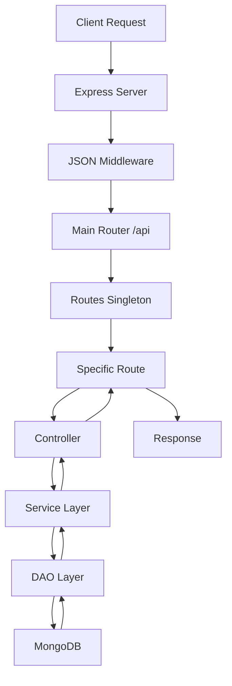

# Test-2 Application

A modern, type-safe Node.js backend application built with TypeScript and Express.js, featuring modular architecture for RESTful API services.

## 📋 Table of Contents
- [Overview](#overview)
- [Features](#features)
- [Technology Stack](#technology-stack)
- [Project Structure](#project-structure)
- [Getting Started](#getting-started)
- [API Endpoints](#api-endpoints)
- [Configuration](#configuration)
- [Development](#development)
- [Deployment](#deployment)
- [Architecture](#architecture)
- [Contributing](#contributing)

## 🎯 Overview

Test-2 is a lightweight, modular backend application designed for POS (Point of Sale) system management. It provides a robust foundation for user management, food inventory, and customer service operations with full TypeScript support and MongoDB integration.

### Key Benefits
- **Type Safety**: Full TypeScript implementation with strict type checking
- **Modular Design**: Clean separation of concerns with singleton pattern
- **Scalable Architecture**: Easy to extend with new modules and features
- **Database Integration**: MongoDB with Mongoose ODM for data persistence
- **Development-Friendly**: Hot reload and build automation

## ✨ Features

- **User Management**: Create and retrieve users with role-based types (cashier, kitchen_helper)
- **Food Management**: CRUD operations for food items with pricing
- **Customer Service**: Basic customer interaction endpoints
- **Greeting Service**: Simple greeting functionality for testing
- **MongoDB Integration**: Full database connectivity with Mongoose
- **JWT Authentication**: Token-based authentication support
- **Input Validation**: Request validation using AJV
- **Error Handling**: Centralized error management
- **Environment Configuration**: Flexible environment-based settings

## 🛠 Technology Stack

| Category | Technologies |
|----------|-------------|
| **Runtime** | Node.js 18+ |
| **Language** | TypeScript 5.9.2 |
| **Framework** | Express.js 5.1.0 |
| **Database** | MongoDB with Mongoose 8.18.0 |
| **Authentication** | JWT (jsonwebtoken 9.0.2) |
| **Validation** | AJV 8.17.1 with formats and errors |
| **Development** | ts-node, nodemon |
| **Build** | TypeScript Compiler (tsc) |

## 📁 Project Structure

```
src/
├── common/
│   ├── constants/
│   │   ├── errors.constants.ts     # Error message constants
│   │   └── httpStatus.enum.ts      # HTTP status code enums
│   └── responseHandler.ts          # Standardized response handling
├── config/
│   └── app.config.ts              # Application configuration
├── controller/
│   ├── customer.controller.ts      # Customer business logic
│   ├── food.controller.ts         # Food management logic
│   └── user.controller.ts         # User management logic
├── dao/
│   ├── food.dao.ts               # Food data access layer
│   └── user.dao.ts               # User data access layer
├── dto/
│   ├── food/
│   │   └── createFood.dto.ts     # Food creation data transfer object
│   └── user/
│       └── createUser.dto.ts     # User creation data transfer object
├── interface/
│   ├── models/
│   │   ├── food.interface.ts     # Food model interface
│   │   └── user.interface.ts     # User model interface
│   ├── util/
│   │   └── userTypes.enum.ts     # User type enumerations
│   └── error.interface.ts        # Error interface definitions
├── loader/
│   └── mongo.loader.ts           # MongoDB connection loader
├── middleware/
│   └── validation.middleware.ts   # Request validation middleware
├── models/
│   ├── food.model.ts            # Mongoose food schema
│   └── user.model.ts            # Mongoose user schema
├── routes/
│   ├── customer.routes.ts        # Customer route definitions
│   ├── food.route.ts            # Food route definitions
│   ├── greeting.route.ts        # Greeting route definitions
│   ├── user.route.ts            # User route definitions
│   └── routes.ts                # Main route aggregator
├── service/
│   ├── food.service.ts          # Food business logic
│   └── user.service.ts          # User business logic
└── app.ts                       # Application entry point
```

## 🚀 Getting Started

### Prerequisites

- **Node.js**: Version 18.x or higher
- **npm**: Comes with Node.js
- **MongoDB**: Local instance or MongoDB Atlas connection
- **TypeScript**: Installed globally (optional but recommended)

### Installation

1. **Clone the repository**
   ```bash
   git clone <repository-url>
   cd app-1
   ```

2. **Install dependencies**
   ```bash
   npm install
   ```

3. **Environment Setup**
   Create a `.env` file in the root directory:
   ```env
   PORT=3000
   MONGODB_URI=mongodb://localhost:27017/test2db
   JWT_SECRET=your-secret-key
   JWT_EXPIRATION=1d
   ```

4. **Build the application**
   ```bash
   npm run build
   ```

5. **Start development server**
   ```bash
   npm run dev
   ```

The application will start on `http://localhost:3000` (or your configured PORT).

## 📚 API Endpoints

### Base URL: `/api`

#### 🔹 Greeting Service
| Method | Endpoint | Description | Request Body |
|--------|----------|-------------|--------------|
| GET | `/api/greeting/` | Simple hello world | None |
| POST | `/api/greeting/` | Personalized greeting | `{"name": "string"}` |

#### 🔹 Customer Service
| Method | Endpoint | Description | Request Body |
|--------|----------|-------------|--------------|
| GET | `/api/customer/` | Get customer info | None |
| POST | `/api/customer/` | Create/update customer | `{"name": "string"}` |

#### 🔹 User Management
| Method | Endpoint | Description | Request Body |
|--------|----------|-------------|--------------|
| POST | `/api/user/` | Create new user | User object (see below) |
| GET | `/api/user/:email` | Get user by email | None |

**User Creation Request:**
```json
{
  "name": "John Doe",
  "email": "john@example.com",
  "password": "securePassword123",
  "type": "cashier" // or "kitchen_helper"
}
```

#### 🔹 Food Management
| Method | Endpoint | Description | Request Body |
|--------|----------|-------------|--------------|
| POST | `/api/food/` | Create food item | Food object |
| GET | `/api/food/` | Get food items | None |

**Food Creation Request:**
```json
{
  "name": "Burger",
  "description": "Delicious beef burger",
  "price": 12.99
}
```

### Response Format
All API responses follow a consistent structure:

**Success Response:**
```json
{
  "data": {
    // Response data object
  }
}
```

**Error Response:**
```json
{
  "error": {
    "message": "Error description",
    "code": "ERROR_CODE"
  }
}
```

## ⚙️ Configuration

The application uses environment variables for configuration. Default values are provided for development.

| Variable | Default | Description |
|----------|---------|-------------|
| `PORT` | 3000 | Server port |
| `MONGODB_URI` | - | MongoDB connection string |
| `JWT_SECRET` | "secret" | JWT signing secret |
| `JWT_EXPIRATION` | "1d" | JWT token expiration |

## 🔧 Development

### Available Scripts

| Command | Description |
|---------|-------------|
| `npm run dev` | Start development server with hot reload |
| `npm run build` | Compile TypeScript to JavaScript |
| `npm start` | Start production server |
| `npm run watch:dev` | Watch TypeScript files for changes |

### Development Workflow

1. **Make changes** to TypeScript files in the `src/` directory
2. **Hot reload** automatically restarts the server (via nodemon)
3. **Build** the project before deployment: `npm run build`
4. **Test endpoints** using curl, Postman, or similar tools

### Adding New Features

1. **Create interfaces** in `src/interface/models/`
2. **Define models** in `src/models/`
3. **Implement DAO** in `src/dao/`
4. **Create services** in `src/service/`
5. **Add controllers** in `src/controller/`
6. **Define routes** in `src/routes/`
7. **Register routes** in `src/routes/routes.ts`

## 🚀 Deployment

### Production Build

1. **Install dependencies**
   ```bash
   npm install --production
   ```

2. **Build the application**
   ```bash
   npm run build
   ```

3. **Set environment variables**
   ```bash
   export PORT=3000
   export MONGODB_URI=your-production-mongodb-uri
   export JWT_SECRET=your-production-secret
   ```

4. **Start the application**
   ```bash
   npm start
   ```

### Using PM2 (Recommended)

```bash
# Install PM2 globally
npm install -g pm2

# Start the application
pm2 start dist/app.js --name "test-2-app"

# Monitor the application
pm2 monit

# View logs
pm2 logs test-2-app
```

## 🏗 Architecture

### Design Patterns

- **Singleton Pattern**: Route classes use singleton pattern for consistent router instances
- **Layered Architecture**: Clear separation between routes, controllers, services, and data access
- **Dependency Injection**: Modular design allowing easy testing and maintenance

### Request Flow



### Core Components

- **App Entry Point**: `src/app.ts` initializes Express and MongoDB
- **Route Management**: Centralized routing with singleton pattern
- **Database Layer**: Mongoose ODM with connection management
- **Error Handling**: Standardized error responses and logging
- **Type Safety**: Full TypeScript coverage with interfaces

## 🤝 Contributing

1. **Fork the repository**
2. **Create a feature branch**: `git checkout -b feature/new-feature`
3. **Make changes** and add tests
4. **Commit changes**: `git commit -m "feat: add new feature"`
5. **Push to branch**: `git push origin feature/new-feature`
6. **Create Pull Request**

### Commit Convention

This project follows [Conventional Commits](https://www.conventionalcommits.org/):

- `feat:` New features
- `fix:` Bug fixes
- `docs:` Documentation changes
- `refactor:` Code refactoring
- `test:` Adding tests
- `chore:` Maintenance tasks

## 📝 License

This project is licensed under the ISC License.

## 📞 Support

For support and questions:
- Create an issue in the repository
- Check the documentation above
- Review the API endpoint examples

---

**Built with ❤️ using TypeScript and Express.js**